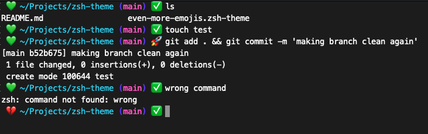

# zsh-theme

A customised version of the [emoji theme](https://github.com/meiokubo-zz/emoji.zsh-theme/tree/main) which adds more emojis and more info on where you are.



## Requirements
* Install oh-my-zsh
* Add `even-more-emojis.zsh-theme` in this repo to `~/.oh-my-zsh/themes/`
* Add the following to `.zshrc`

```
# Path to your oh-my-zsh installation.
export ZSH="$HOME/.oh-my-zsh"

# Set name of the theme to load
ZSH_THEME=emoji
plugins=(
  emoji git
)
source $ZSH/oh-my-zsh.sh
 
```
